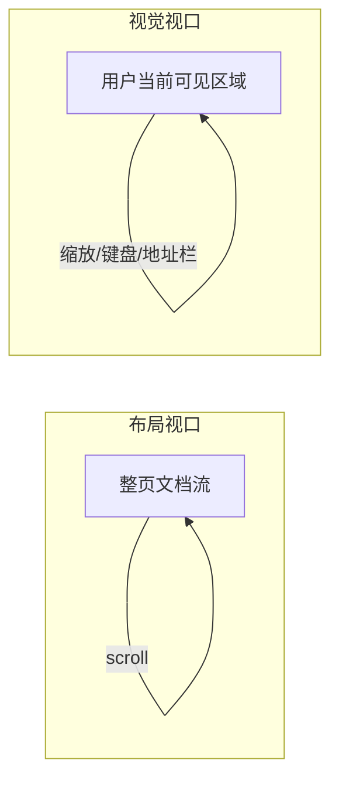

H5 适配不是「把设计稿除以 2」的算术题，而是搞清楚：==浏览器用哪一把尺子画布局==、**屏幕用多少物理点去画**、**你写的 1px 最终落在哪**。本篇把 **布局视口 / 视觉视口**、**DPR**、**rem / vw / px** 放在一条因果链里讲，并给出 **可落地的换算与踩坑清单**。

***

### 一、三条尺子：物理像素、CSS 像素、DPR

\==设备像素（物理像素）==：屏幕硬件上的发光单元，营销里的「1080×1920」通常指这个。

**CSS 像素**：样式里写的 `width:375px` 用的单位。它是 **抽象像素**，与「是否等于一个物理点」**没有固定 1:1** 关系——取决于 **缩放** 与 **设备像素比**。

**DPR（devicePixelRatio）**：在 **同一坐标系** 下，大致可以理解为：

\[
\mathrm{DPR} \approx \frac{\text{某一方向物理像素}}{\text{同一方向 CSS 像素}}
]

常见值 **2、3**。例如宽度方向 **CSS 375px**、**DPR=3**，则物理上大约 **1125 个设备像素** 参与绘制这条「逻辑宽」。

**直接推论**：

1. **1 CSS px 的边框** 在 **DPR=3** 的屏上，至少要占 **3 个物理像素宽**，肉眼容易觉得「粗」——这是 hairline 问题的根源（见《1px》篇）。
2. **截图 / 设计工具** 里标的「px」要先问：**是设计稿坐标还是物理像素**。移动端常见 **750 宽设计稿** 往往对应 **2× 稿**（相对 375 CSS 宽），切图与 **postcss 换算** 要统一基准。

***

### 二、布局视口 vs 视觉视口（先建脑图）

移动端浏览器为了在「窄屏上看桌面站」，引入了 **两个视口**（概念上）：

| 视口 | 你在调试时关心的点 |
|------|---------------------|
| **布局视口（Layout Viewport）** | **document** 整体布局的「画布宽度」；**`position: fixed` 常以它为参照**（实现细节随浏览器略有差异，但排障时先按这个模型理解）。 |
| **视觉视口（Visual Viewport）** | 用户 **当前屏幕上能看到的那一块**；**缩放、地址栏收起、软键盘** 会动它。 |

**键盘弹出**时：布局视口未必立刻等于「可见高度」，于是出现 **底部输入框被挡、整页被顶飞**——这需要 **VisualViewport API** 单独处理（见《键盘》篇）。



***

### 三、`meta viewport` 逐项拆解

典型写法：

```html
<meta
  name="viewport"
  content="width=device-width, initial-scale=1, minimum-scale=1, maximum-scale=1, viewport-fit=cover"
/>
```

| 指令 | 深入一点 |
|------|-----------|
| **width=device-width** | 让 **布局视口宽度** 跟随 **设备在竖屏下的 CSS 宽度**（近似 `window.innerWidth` 在未缩放时）。不写时，移动 Safari 可能用 **980px 级** 的默认布局视口，页面像「缩小版桌面站」。 |
| **initial-scale=1** | 初始缩放为 1；与 **width** 共同决定 **首屏 CSS 宽度**。二者冲突时以浏览器规则为准，**不要依赖未文档化的组合**。 |
| **maximum-scale=1 / user-scalable=no** | **禁止用户双指缩放**，对 **弱视用户不友好**，也可能影响 **部分系统字体放大** 场景；若业务强依赖，建议 **仅关键页** 使用并留 **无障碍出口**。 |
| **viewport-fit=cover** | 告诉浏览器 **页面可延伸到刘海/圆角区域**，**`env(safe-area-inset-*)` 才有非零值**（见《安全区》篇）。 |

***

### 四、rem：把「整站比例」绑在根字号上

**机制**：`rem` = **相对 `html` 的 font-size**。

**经典流程**（示意，非唯一写法）：

1. 设计稿 **750px 宽**，约定 **1rem = 屏幕宽度 / 10**（举例）。
2. 在 `document.documentElement` 上 **用 JS** 设置 `font-size`（或用 **vw** 直接写死 `html { font-size: 10vw }` 一类方案，本质仍是对齐宽度的比例）。
3. 业务样式全用 **rem**，由构建工具把设计稿上的 **px 转 rem**。

**优点**：强依赖 **设计稿等比缩放** 时，**整站一起涨缩**，还原度好控。

**必须面对的代价**：

* **首屏 FOUC**：若根字号靠 **外链 JS** 设置，可能出现 **先小后大**；对策：**内联关键脚本**、或 **首屏关键 CSS 用 px/vw 固定**。
* **横竖屏切换**：`window.innerWidth` 变化 → 根字号变化 → **布局抖动**；需要 **节流 / 只更新非关键区**。
* **与 postcss-pxtorem 的配合**：`selectorBlackList`、`propList` 要排除 **1px 边框**、**第三方组件**，否则 **细线被转 rem** 更难控。

**一段极简「按宽度设根字号」示例（仅作理解用）**：

```js
function setRootFontSize() {
  const docEl = document.documentElement;
  const width = docEl.clientWidth;
  // 例：375 设计基准 → 37.5px = 1rem，按你们设计稿比例替换
  docEl.style.fontSize = `${width / 10}px`;
}
window.addEventListener('resize', setRootFontSize);
setRootFontSize();
```

***

### 五、vw：直接绑定布局视口宽度

**定义**：`1vw` = **布局视口宽度** 的 1%。**不依赖** 根字号脚本，**与 rem 相比更少一层「JS 设 html」**。

**常见坑**：

1. **`100vw` 与 `100%`**：在 **有竖向滚动条** 的桌面浏览器里，`100vw` **包含滚动条占位**，可能出现 **横向滚动条**；移动端无滚动条时影响小，但 **嵌套 iframe** 仍要小心。
2. **`vmin` / `vmax`**：做 **横竖屏同时适配** 时有时比死用 `vw` 更稳。
3. **新单位**：`dvw` / `svw` / `lvw`（大中小视口）在 **新浏览器** 里可缓解 **移动端地址栏显隐** 带来的 **100vh 问题**——与 **`-webkit-fill-available`**、**`100dvh`** 等可对照文档渐进使用。

***

### 六、选型：不要「为了 rem 而 rem」

| 场景 | 建议 |
|------|------|
| **老项目、设计强绑 750、已有 pxtorem** | 继续 **rem + 构建插件**，把 **例外规则** 写清楚。 |
| **组件库、要同时服务 PC/平板** | **clamp + 媒体查询 + flex/grid**，比强行全局 rem **更可维护**。 |
| **仅移动端 H5、设计用 vw 标注** | **postcss-px-to-viewport** 或手写 **vw**，减少 **根字号 JS**。 |

***

### 七、排障清单（建议打印）

1. **`window.devicePixelRatio` 是多少？** 影响 **1px、阴影、模糊**。
2. **`document.documentElement.clientWidth` 与预期一致吗？** 不一致先查 **viewport**。
3. **是否混用了 rem 与固定 px？** 混用点往往在 **第三方组件根节点**。
4. **横屏测过吗？** `safe-area`、**横屏刘海** 与竖屏不是同一套视觉。

***

### 八、收束

适配的本质是：**先锁定布局视口（viewport）→ 再选比例系（rem 或 vw）→ 再处理特例（安全区、键盘、hairline）**。下文《安全区》《1px》《键盘》《滚动》四篇把特例拆开写深。
