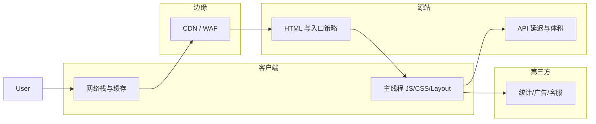

性能不是「某个组件写坏了」这一种病，而是横跨 ==网络、运行时、框架、业务数据形态、发布与观测== 的 **系统问题**。这篇站在 **架构师视角**：先给 **约束与目标**，再给 **因果链与杠杆**，最后落到 **优先级与治理**；实现细节仍在同系列分篇。

***

### 一、先把话说清：性能是哪一种「质量属性」

在架构文档里，性能通常和 ==可用性、安全、成本== 同一层级讨论。对前端而言，建议显式写出三类 **约束**（数字按业务定，这里只给结构）：

1. **体验约束**：关键路径的 **Web Vitals** 或等价指标（如 LCP/INP/CLS 的 P75/P95），以及 **业务特有** 的「首屏可操作时间」。
2. **资源约束**：首包/总包 **gzip/brotli 上限**、第三方脚本个数上限、图片单页总字节上限。
3. **成本约束**：CDN 流量、构建耗时、客户端 CPU（低端机占比）——**优化不是无限投入**，要在 **体验增益 vs 工程复杂度** 间折中。

没有约束的「优化」容易变成 **局部炫技**：某页 Lighthouse 满分，但 **核心业务路径** 仍慢。

***

### 二、系统视图：浏览器不是世界的全部

现代页面性能 = **浏览器主线程 + 网络路径 + 边缘缓存 + 源站/API + 第三方供应链**。

**架构含义**：

* 再极致的前端分包，也救不了 **API P99 3s**；要先对齐 **全链路 SLO**。
* **第三方脚本** 是性能上的 **供应链风险**：单点脚本拖垮主线程，责任却在 **采购/合规/埋点 owner**，不只是前端。

***

### 三、一条心智模型：关键路径 vs 非关键路径

**关键路径**决定用户是否「认为系统可用」：首屏可见、首笔可交互、主任务链路（如下单、提交）。\
**非关键路径**可以降级：非首屏模块、推荐位、运营位、可延迟统计。

架构决策应反复问：**我们是否在关键路径上加载了非关键能力？**\
典型反模式：首屏同步拉 **全量权限树**、**全站路由代码**、**所有微前端子应用**——本质是 **把「将来可能用到」当成了「现在必须」**。

***

### 四、浏览器运行时：为何问题会分成「几大类」

从 **运行时资源竞争** 看，前端瓶颈几乎总落在下面四条之一（与现象表对应）：

| 竞争维度 | 本质 | 典型症状 |
|----------|------|----------|
| **带宽与 RTT** | 字节 × 往返 | 白屏久、瀑布图长、LCP 晚 |
| **主线程时间** | parse + execute + 框架 + 业务同步计算 | 点击迟、INP 差、TBT 高 |
| **布局与绘制** | Layout/Paint 成本 × 频率 | 滚动卡、动画掉帧 |
| **内存与 GC** | 存活对象与泄漏 | 久驻变慢、移动端杀进程 |

**Worker / OffscreenCanvas** 等是 **显式把 work 搬出主线程**；多数业务仍要以 **主线程预算** 为主做架构取舍。

***

### 五、现象 → 根因类 → 架构杠杆（加深版）

下面这张表比「先查什么」更进一步：多一列 **根因类**（便于跨项目迁移经验）与 **杠杆**（改架构还是改实现）。

| 现象 | 根因类（抽象） | 架构杠杆 | 先验证 |
|------|----------------|----------|--------|
| 首屏/LCP 差 | 关键资源过晚、体积过大、优先级错误 | 入口拆分、边缘缓存、SSR/SSG 策略、关键资源 `preload` | Network 瀑布 + LCP 元素 |
| 可交互晚 / INP 差 | 主线程长任务、框架级重渲染、同步重计算 | 路由/组件分割、列表虚拟化、计算下沉 Worker/BFF、第三方治理 | Performance 长任务分解 |
| 滚动掉帧 | 布局 thrash、每帧重绘过大、DOM 规模 | 虚拟列表、动画走合成层、减少强制布局 | Layout/Paint 占比 |
| 内存涨 | 生命周期未闭合、全局缓存无界、闭包持有 DOM | 组件边界与 dispose 规范、缓存 LRU、数据分页 | Memory 快照对比 |
| CLS 大 | 无预留空间、异步插入、字体策略 | 布局契约（宽高/骨架）、广告位占位、字体子集与 `font-display` | Layout Shift 录制 |

**杠杆优先级经验**：同一问题，**改数据形态**（少传、分页、只读摘要）往往优于 **改组件里一个 `v-if`**；**改入口与加载策略** 往往优于 **改某个 CSS 选择器**——除非 Profile 已锁死 Paint。

***

### 六、架构级权衡（没有免费午餐）

| 决策 | 换来的 | 付出的代价 |
|------|--------|------------|
| **SSR / 流式 SSR** | 首屏 HTML、SEO | 注水成本、数据一致性、运维与缓存策略复杂 |
| **极致缓存（immutable）** | 命中率高 | 发布与回滚要配套；HTML 策略必须独立 |
| **虚拟列表** | 大列表可滚动 | 行高可变时工程难度；可访问性与搜索行为要想清 |
| **BFF 聚合接口** | 前端少往返、字段贴合 | BFF 成为瓶颈；类型与版本契约要治理 |
| **微前端 / 多包** | 团队并行 | 公共依赖重复、运行时集成成本、性能预算更难统一 |

架构师的工作不是选「最时髦」，而是选 **在约束下可维护** 的那条。

***

### 七、优先级框架：影响 × 成本 × 可逆性

1. **高影响 / 低成本 / 易回滚**：缓存头、路由分包、删未用依赖、第三方延迟——通常先做。
2. **高影响 / 高成本**：大列表架构、SSR 改造、数据接口重塑——需要 **里程碑与里程碑上的指标**。
3. **低影响 / 高成本**：细粒度 CSS 调参——除非已证明瓶颈在 Paint，否则往后排。

再补一条 **「尾部用户」** 视角：若 P95/P99 主要来自 **弱网 + 低端机**，优化要对着 **节流 CPU、减小包、减少同步** 下手，而不是只在开发机上看 Lighthouse 满分。

***

### 八、可观测性：没有度量就没有架构迭代

建议至少三层，职责不同：

| 层级 | 做什么 | 典型工具/做法 |
|------|--------|----------------|
| **CI / 构建** | 防 **体积与依赖** 回归 | size-limit、依赖审计、重复包检测 |
| **实验室** | 可复现对比、发版门禁 | Lighthouse、固定节流 |
| **RUM** | 真实网络/设备/地域 | web-vitals 上报 + 分位数 |

**架构要点**：指标要 **分业务路径**（登录后首页 vs 报表页），不要只盯全站平均；**SLO 违反** 要能 **告警到 owner**（前端 + 网关 + 后端接口人）。

***

### 九、治理：性能是「集体责任」

* **预算 owner**：谁改 `package.json` 重大依赖、谁对包体签字。
* **第三方 owner**：每个外联脚本有业务负责人与 **降级策略**（超时、异步、失败不影响主流程）。
* **评审清单**：AI 辅助写的代码同样走 **性能相关项**（见系列《审查清单》篇）。

没有流程，架构文档里的数字会变成 **纸面 SLO**。

***

### 十、案例复盘（仍虚构，但贴近真实决策）

**背景**：B 端后台，首屏 3s+，报表页滚动掉帧。\
**观测**：RUM 显示 LCP 与 INP 双差；Performance 长任务集中在 **大表格 + 第三方统计**。\
**架构动作**：

1. 表格数据 **服务端分页 + 前端虚拟列表**（改数据形态与渲染策略）。
2. 路由与重型图表 **动态导入**（改入口策略）。
3. 统计脚本 **idle 后加载**（改第三方策略）。
4. CI **gzip 阈值** + 报表页 **专项采样**（防回归）。\
   **结果**：P75 LCP/INP 改善；成本是 **表格交互语义**（全选、导出）要单独设计，避免「虚拟化后行为不一致」。

***

### 十一、本系列文章索引

| 文章 | 侧重 |
|------|------|
| 《网络与静态资源：请求、缓存与体积实践》 | 压缩、缓存头、Vite 分包、preload |
| 《渲染与绘制：重排、合成与滚动性能》 | 强制布局反例、rAF、transform |
| 《JavaScript 与加载：主线程、分包与长任务》 | 动态 import、Worker、拆包配置 |
| 《长列表与图片：虚拟滚动、懒加载与格式优化》 | 虚拟列表思路、picture/srcset |
| 《Web Vitals 与监控：LCP、INP、CLS 及落地做法》 | 指标、web-vitals 上报示例 |
| 《Vue 项目中的性能实践：组件、列表与状态》 | shallowRef、路由懒加载、列表 |
| 《用 DevTools 与 Lighthouse 做性能排查（操作流程）》 | 录制顺序、看板解读 |
| 《性能预算与 CI：体积阈值、回归与团队协作》 | size-limit、工作流 |
| 《内存与泄漏：事件监听、闭包与 SPA 常见坑》 | onUnmounted 模板、缓存淘汰 |
| 《SSR 与注水（Hydration）：首屏与可交互时间的权衡》 | 不一致案例、选型 |

***

### 十二、小结

架构师视角下的性能：**先定义 SLO 与关键路径，再在全链路找瓶颈，用可逆的、可度量的手段迭代，并用预算与观测把它变成工程习惯。** 细节实现请从《网络与静态资源》按关键路径逐项落地。
