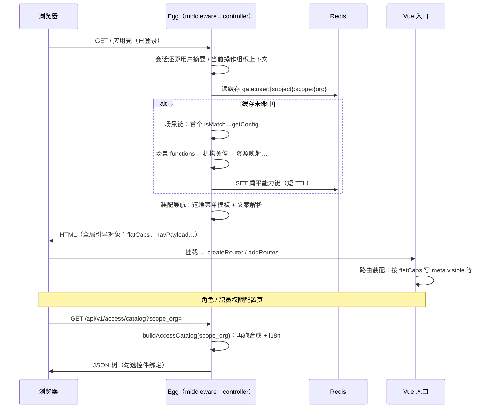

某 **机构客户门户** 采用 **Egg 单应用 + Vue 3 SPA**：多套地域部署共用一套仓库，通过 **环境变量** 切换站点；权限上既要支撑 **个人 / 机构 / 合规 / 内部代管** 等产品形态，又要让 **同一套前端路由与后端接口** 在不同形态下自动 **收窄菜单与 API 可见范围**。工程上使用 **`sceneManager`**（策略链 **`IScene`**）在请求级产出 **场景配置快照**，再与 **中心化机构策略**、**使用者 RPC 权限** 合成 **扁平能力键与 ACL 树**。下文按 **仓库拓扑 → 端到端流程 → 示意代码 → 场景理论** 展开。**文中所有代码块均为架构示意**，字段名、路径、类名已与真实仓库 **刻意不一致**，不可复制粘贴进业务工程。

***

### 仓库拓扑（Plume `::: file-tree`）

下列 **文件树** 为主题内置容器渲染；已省略 `node_modules`、构建产物及大量业务页面，仅保留与 **场景 / 权限 / 首屏注入 / 路由** 相关的骨架。

::: file-tree title="门户单体仓库（示意）" icon="simple"

* portal/
  * server/
    * app/
      * controller/ # render（HTML）、permission、menu…
      * extend/ # context：能力解析、场景快照、会话字段
      * middleware/
      * router/
      * sceneManager/
        * scenes/ # 各地域 / 角色形态 Scene 实现
        * sceneConfig/ # 静态权限树与 functions 列表
      * service/ # 访问合成、导航装配等
      * view/ # shell 模板（注入全局引导对象）
    * config/
    * configcenter/ # 菜单 JSON、特性开关等（示意）
  * client/
    * src/
      * api/ # 访问目录拉取、业务 REST
      * helpers/ # 路由门闸、菜单格式化等
      * router/ # 动态路由 / meta.gates
      * stores/
      * views/

:::

**分层口诀**：**场景决定「能开通哪些功能模块」**；**机构关停配置决定「该机构实际开通了哪些」**；**使用者绑定决定「这个人能用哪些原子权限 key」**。前端 **`routesBuilder`**（名称泛指「路由装配器」）只做 **UX 层裁剪**，不能替代服务端 **`assertGate(...)`** 一类接口鉴权。

***

### 端到端流程：首屏 HTML → Vue 路由 → 权限树接口

整体上存在 **两条「权限形状」出口**：其一是 **首屏嵌入的扁平能力键列表**（文中统称 **`flatCaps`**，真实项目常用逗号串注入）；其二是 **「权限目录」JSON 接口**（下文用虚构路径 **`GET /api/v1/access/catalog`** 表示**这一类**接口）。二者底层都走 **同一套「场景快照 × 机构策略 × 用户绑定」合成**，因此 **场景顺序或地域弄错** 会 **同时弄歪菜单与配置页**。



**各阶段「能得到的效果」**（便于对照验收）：

| 阶段 | 依赖输入 | 对用户可见的结果 |
|------|-----------|------------------|
| **壳 HTML** | 当前操作组织、权限语义角色、地域 | **侧边栏**：`navPayload` 已服务端裁剪；首屏即可得的 **`flatCaps`** |
| **路由装配** | 静态路由上的 `meta.gates` / 自定义函数 | **路由表**：无权的节点标记不可用；**默认重定向** 落到首个允许路由 |
| **目录接口** | Query **`scope_org`**（示例名，表示「要为哪个组织装配目录」） | **嵌套树**：服务端翻译标签；勾选结果写回 **权限写入 RPC** |
| **业务 JSON API** | Handler 内二次校验 | **403**：前端绕过路由不可删服务端门禁 |

***

### 示意代码：首屏 HTML —— 扁平能力与导航并行注入（非等价节选）

以下 **仅表达顺序与分工**：真实仓库的方法名、getter 名、模板文件名均不同。

```js
// ShellController#bootstrapPage —— 纯属虚构 API
async bootstrapPage() {
  const activeOrgKey = await this.ctx.sessionFacade.activeOrgKey();
  const roleSlice = await this.ctx.sessionFacade.permissionSemanticRole();

  const flatCaps = await this.ctx.accessFacade.resolveFlatCapabilities();
  // 典型内部逻辑（示意）：Redis → miss → PolicySvc ∩ OrgRegistry ∩ SubjectBinding

  const navPayload = await this.ctx.navFacade.materializeSidebar();

  await this.ctx.render('shell.html', {
    flatCaps: flatCaps.join('|'),       // 故意不用逗号，避免与真实注入格式混淆
    navPayload,
    activeOrgKey,
    roleSlice,
    switchOrgAllowed: policy.allowOrgSwitcher(roleSlice, orgSnapshot),
    localeTag: this.ctx.locale,
    policyRevision: orgSnapshot.configRevision,
    experimentFlags: snapshot.flags,
  });
}
```

**设计取舍**：首屏只带 **扁平能力键**，不带完整 **ACL 树** —— **减小 HTML**；完整树留在 **第二类接口**，便于 **`scope_org` 切换**（例如代管场景下给 **另一法人视图** 授权）。

***

### 示意代码：内联引导对象（虚构全局名）

真实项目可能叫 `_params`、`_bootstrap`、`__SHELL__` 等；此处统一用 **`window.__PORTAL_BOOT__`**，字段亦为演示。

```html
<script>
  window.__PORTAL_BOOT__ = {
    runtimeEnv: '<%= runtimeEnv %>',
    subjectId: '<%= subjectId %>',
    homeOrgKey: '<%= homeOrgKey %>',
    activeOrgKey: '<%= activeOrgKey %>',
    roleSlice: <%= Number(roleSlice) %>,
    flatCaps: '<%= flatCaps %>',
    navPayload: <%= JSON.stringify(navPayload) %>,
    localeTag: '<%= localeTag %>',
    policyRevision: <%= Number(policyRevision) %>,
    experimentFlags: <%= JSON.stringify(experimentFlags) %>
  };
</script>
```

```ts
// appShellStore.ts —— 纯属虚构模块名
const boot = window.__PORTAL_BOOT__;

export const shellStore = {
  capabilitySet: new Set((boot.flatCaps || '').split('|').filter(Boolean)),
  roleSlice: boot.roleSlice,
  activeOrgKey: boot.activeOrgKey,
};
```

```ts
// GateEvaluator —— AND/OR 表达能力键（示意）
function holds(cap: string) {
  return shellStore.capabilitySet.has(cap);
}
```

***

### 示意代码：路由装配 —— 能力键与功能开关（节选）

真实实现会对 **`meta`** 写入 **可见性 / 功能开关 / 聚合可用性**；下列函数名、字段名均为演示。**`holds(cap)`** 表示「当前会话是否具备原子能力键」，由外壳注入，下文不重复实现。

```ts
export function attachGateMeta(raw: RouteRecordRaw[]) {
  const tree = structuredClone(raw);
  const gateAllows = (capExpr: string | string[]) =>
    Array.isArray(capExpr) ? capExpr.every(holds) : holds(capExpr);

  const dfs = (node: RouteRecordRaw, parent?: RouteRecordRaw) => {
    node.path = `${parent?.path ?? ''}/${node.path}`.replace(/\/{2,}/g, '/');
    const meta = node.meta ?? {};
    const { gates, gatePredicate } = meta;

    if (typeof gatePredicate === 'function') {
      meta.routeAllowed = gatePredicate();
    } else if (gates?.length) {
      meta.routeAllowed = gates.some(group =>
        Array.isArray(group) ? group.every(g => gateAllows(g)) : gateAllows(group),
      );
    }

    node.children?.forEach(ch => dfs(ch, node));
    if (node.children?.length) {
      meta.branchReachable = node.children.some(c => c.meta?.branchReachable ?? c.meta?.routeAllowed);
    } else {
      meta.branchReachable = meta.routeAllowed;
    }
    node.meta = meta;
  };

  tree.forEach(r => dfs(r));
  return tree;
}
```

**效果**：侧栏与 **`RouterView`** 对齐；直达 URL 时 **`beforeEach`** 可读 **`meta.routeAllowed`** 拦截（策略各团队自定）。

***

### 示意代码：访问目录接口与前端缓存（路径虚构）

```js
// 路由注册 —— 演示用路径，勿与生产路由混淆
router.get('/api/v1/access/catalog', ctrl.access.buildCatalog);

async buildCatalog() {
  const scopeOrg = Number(this.ctx.query.scope_org);
  const tree = await this.ctx.accessSvc.composeAclTree(scopeOrg);
  this.ctx.body = { ok: true, data: tree };
}
```

```ts
const catalogCache = new Map<number, AclNode[]>();

export async function loadAccessCatalog(scopeOrg: number, bust = false) {
  if (!catalogCache.has(scopeOrg) || bust) {
    const { data } = await apiClient.get('/api/v1/access/catalog', {
      params: { scope_org: scopeOrg },
    });
    if (Array.isArray(data) && data.length) catalogCache.set(scopeOrg, data);
  }
  return structuredClone(catalogCache.get(scopeOrg) ?? []);
}
```

**权限配置子组件**（真实文件名各异）：挂载时 **`loadAccessCatalog(scopeOrg)`**，并与 **角色绑定查询** 并行，合成 **默认勾选集**。

***

### 示意代码：场景功能全集 ∩ 机构关停（节选）

```js
async pickOfferedFeatures(orgBizKey) {
  const [registryRow, sceneSnap] = await Promise.all([
    this.ctx.orgRegistry.snapshot(orgBizKey),
    this.ctx.policyScene.currentSnapshot(),
  ]);

  let offered = sceneSnap.featureCatalog ?? [];
  const banned = extractDisabledFeatures(registryRow.policyBlob);

  // 联动规则纯属示例：关掉「职员权限编辑」则隐含关掉「角色模板编辑」
  if (banned.has('staff_acl_edit')) {
    banned.add('role_template_edit');
  }

  return offered.filter(code => !banned.has(code));
}
```

**效果**：场景 **静态目录** 给出上限；机构策略 **关停表** 再裁剪；之后的 **资源映射** 只对 **幸存功能码** 展开原子键。

***

### 一、为何要单独抽象「场景」

若仅用「地域」或仅用「登录角色」决定菜单，很快会遇到：

1. **同一地域内** 仍存在 **个人 / 机构 / 合规 / 内部代管** 等互斥产品形态；
2. **同一机构账号** 又因 **账户结构（主户 / 子户）**、**是否托管通道客户（TAMP 等）**、**中心化开户策略** 等 **运行时属性**，需要动态收窄功能列表；
3. **部分地域站点** 行为路径更简单时，可用 **单场景类** 覆盖，但仍要在 **内部账号 viewing 自身机构 vs 代管外部机构** 时分叉配置。

因此「场景」被定义为：**在单次请求上下文中，能把上述因子收敛成一张配置表的决策单元**——而不是简单的「国家码路由」。

***

### 二、启动期注册：`SceneStrategy` 与配置清单

应用在 **`didReady`** 阶段初始化场景策略：从配置中读取 **当前进程允许参与匹配的场景类名列表**，在约定目录下 **动态 import** 对应模块并实例化，再按配置顺序加入 **`scenes` 数组**。

若清单为空，初始化直接失败并退出进程——这是一种 **强制显式配置** 的策略，避免线上静默落入默认全开。

***

### 三、请求期匹配：有序链路与短路

每个场景实现统一契约：**异步判断是否命中（`isMatch`）**、**异步产出配置（`getConfig`）**。

请求到来后，策略器 **按注册顺序** 遍历场景：对每一个实例调用 `isMatch`；**首个返回 true** 的场景被选中，随后由其 `getConfig` 生成配置。**顺序即优先级**：例如在同一地域内，若 **合规专员场景** 排在 **个人场景** 之前，则合规身份会优先命中合规裁剪集，而不会落到个人配置。

某一地域常见做法是：**合规场景 → 个人场景 → 机构场景**（具体顺序以仓库配置为准）。

***

### 四、工厂与隔离：`SceneFactory` 与深拷贝

选中场景后，工厂对象调用 `getConfig`，并对结果做 **深拷贝** 再交给请求上下文缓存。

这样做的直接意图是：**避免多个请求共享同一份可变配置对象**。尤其在机构场景中，往往会在基础配置上 **过滤 `functions` 数组**、改写树节点；若引用共享，会出现 **极低概率的并发串扰** 或 **调试时「刚才明明删了权限突然又回来了」** 的假象。

***

### 五、请求上下文中的角色推导：`getUidPermissionType`

场景匹配往往依赖 **权限语义下的用户类型**，而不仅是账户枚举值。上下文扩展里实现了 **「登录类型 + 是否正在操作其他机构」** 的推导：例如在特定地域下，内部管理员登录 **本机构** 与 **代管其他机构** 会被映射为 **不同的权限类型常量**，以便机构场景在 `getConfig` 里区分 **全功能机构视图** 与 **仅限报表类能力的代管视图**。

会话中的 **「当前操作机构」** 与 **归属机构** 分离，是此类门户的常见产品设计；场景层必须读到一致快照，否则会错误匹配到「机构主场景」并下放过高功能集。

***

### 六、权限如何「合成」：场景配置 × 账户关停 × 使用者绑定

场景配置通常携带：**功能键列表 `functions`**、**权限树骨架 `resourceTree`**、以及 **`filterResources` / `hiddenResourceInTree` / `commonResources`** 等用于裁剪树或默认放行集合的字段。

权限服务中的典型管线可概括为：

1. **拉取当前场景**，得到 **`supportFunctions`**（场景允许的功能全集）；
2. **读取中心化账户策略**，解析出 **机构维度关停的功能集合**，与场景功能求 **差集**；
3. **角色联动规则**：例如某功能关闭时 **级联关闭** 关联模块（代码中以「使用者权限跟随」等形式出现）；
4. **由功能键映射到资源权限键**：通过 **`ResourceMap`** 把功能模块展开为 **原子权限 key**；
5. **再减去场景级 `filterResources`**，并处理若干 **跨模块特例**（例如某功能未开放时，从跟进类模块中剔除依赖它的子权限点）；
6. **细粒度到使用者** 时，还要与 **交易者权限 RPC** 返回值 **求交**，并减去 **`hiddenResourceInTree`**，保证 UI 树与 API 授权对齐。

由此，**最终权限** 从来不是单一表格查表，而是：**场景（地域 + 产品形态 + 内部/外部视角）**、**机构策略**、**个人绑定** 三层 **交集**。

***

### 七、机构场景中的动态收窄（读懂「一套代码多形态」）

机构类场景的 `getConfig` 往往最具代表性：

* **先判定机构属性**：是否 **托管运营（OM）模型**，选择不同的静态配置模板；
* **再按账户结构**：例如 **子账户** 去掉「账户分组」等功能键；
* **再按运行时查询**：如 **报表灰池** 类依赖是否存在，决定是否保留某类灰盘交易报表；
* **内部用户代管其他机构时**：在配置阶段 **把功能列表过滤为仅匹配某一命名模式（如报表前缀）**，等价于 **强制最小权限面板**，避免内部账号在客户 Org 上下文中拥有完整运营菜单。

另一地域分支机构场景则可能额外判断 **是否某类通道用户**，从而剔除 **投资建议管理** 等相关功能键——同一套代码文件中 **地域常量 + 业务 RPC** 共同决定裁剪路径。

单地域简化站点则在 **`isMatch` 仅用地域开关**，而在 `getConfig` 内 **按内部角色与机构上下文** 在 **「对外机构模板」与「内部管控模板」** 之间切换。

这些分支说明：**场景不仅负责「选表」，还负责「在同一张基表上继续做运行时减法」**。

***

### 八、一致性与边界条件

**未命中场景**：策略链全部失败时返回空配置；上层若未兜底，可能导致 **菜单或权限接口异常**。日志中会带上地域与机构上下文便于排查——此类问题多见于 **新增角色但未注册场景**、或 **`isMatch` 抛错被吞掉返回 false**。

**免登录外部接口**：上下文扩展中留有注释指出：在未登录路径下 **用户信息、场景依赖字段不可用**，场景与上下文耦合会带来局限；长期可考虑 **将场景所需输入收缩为显式 DTO**，而非隐式依赖完整 `ctx`。

**顺序敏感**：合规与个人同为布尔可区分身份时，**注册顺序决定解释权**；文档化与 CR 评审应把 **`config.scenes` 数组顺序** 当作 **权限产品规格** 的一部分。

***

### 九、示例：`IScene` 形状与策略遍历（抽象 TypeScript）

```ts
interface SceneContext {
  siteRegion: string;
  userKind: string;
  operateOrgId: number | null;
  homeOrgId: number | null;
}

interface IScene {
  isMatch(ctx: SceneContext): Promise<boolean>;
  getConfig(ctx: SceneContext): Promise<SceneConfig>;
}

async function resolveScene(chain: IScene[], ctx: SceneContext): Promise<SceneConfig | null> {
  for (const s of chain) {
    try {
      if (await s.isMatch(ctx)) return structuredClone(await s.getConfig(ctx));
    } catch (e) {
      logFatal(s, e);
    }
  }
  return null;
}
```

***

### 十、示例：机构场景的「静态模板 + 运行时裁剪」

```ts
async function buildInsSceneConfig(ctx): Promise<SceneConfig> {
  let cfg = pickBaseTemplate(await ctx.orgProfile());
  cfg = { ...cfg, functions: [...cfg.functions] };
  if (ctx.accountIsSub()) cfg.functions = cfg.functions.filter(f => f !== 'account_group');
  if (ctx.innerUserManagingOthers())
    cfg.functions = cfg.functions.filter(f => /^reports?_/i.test(f));
  return cfg;
}
```

***

### 十一、示例：权限合成管道（伪代码）

```js
async function effectivePermissions(ctx, orgId, userId) {
  const scene = await ctx.getCurrentScene();
  let funcs = scene.functions;
  const disabledByOrg = await centralPolicy.disabledFunctions(orgId);
  funcs = funcs.filter(f => !disabledByOrg.has(f));
  applyCascadeRules(disabledByOrg, funcs);
  let keys = flattenResourceMap(funcs, scene.filterResources);
  keys = applyCrossModuleExceptions(keys, funcs);
  const userKeys = await rpcTrader.featureKeys(userId);
  keys = intersect(keys, userKeys);
  keys = subtract(keys, scene.hiddenResourceInTree);
  return keys;
}
```

***

### 十二、测试建议：场景矩阵

为 **`isMatch`** 写 **表驱动测试**：列为「地域 × 用户类型 × 当前操作组织是否越权」，行为 **`expectedScenePolicy`**。另应对 **壳 HTML 注入的 `flatCaps`** 与 **目录接口 JSON** 做 **契约快照**（字段名用你们 stabilizer 约定），防止场景改动 **只修一端**。

***

### 十三、小结

在该门户形态中，**场景管理器** 把 **商业维度折叠进请求级配置**；服务端 **访问门面** 再产出 **扁平能力键 + ACL 树**；Vue **路由装配 + 门闸表达式** 消费 **壳引导对象** 完成 **导航体验**。三者缺一不可：**仅有前端裁剪会裸接口**，**仅有后端裁剪会「菜单与接口语义漂移」**。评审时应始终把 **场景注册顺序**、**当前操作组织与归属组织一致性**、**能力缓存失效策略** 纳入同一变更单；**勿以本文示意代码为准对齐真实仓库**，应以内源文档与类型定义为准。
