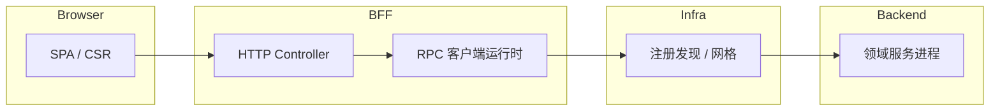

许多 **Node BFF / 门户网关** 需要在 **HTTP 会话上下文**（语言、灰度、调用方身份）下调用 **下游领域服务**。一类常见做法是：**以 Protobuf 为契约**，由 **内部 npm 包（下文统称「RPC 客户端运行时」）** 加载 `.proto`、组装 **帧头 / 路由标签 / 链路字段**，再经 **服务网格或命名服务** 送达 **被调方法**。本文不写某一版本的 Release Note，而从前端架构师常接触的 **BFF 边界** 出发，归纳 **初始化顺序、配置块语义、与 Egg 等框架的粘合方式**，以及 **二进制流式场景的解析套路**。**文中代码与配置均为虚构示意**，路径、包名、标签键均与真实仓库 **刻意不一致**，不可当作可复制配置。

***

### 在整体链路中的位置



**要点**：浏览器 **永远不直接** 使用该运行时；它解决的是 **同一仓库内 BFF 进程** 如何 **类型稳定地** 消费后端能力。

***

### 仓库内典型落点（Plume `::: file-tree`）

::: file-tree title="BFF 中与 RPC 相关的目录（示意）" icon="simple"

* bff-app/
  * app/
    * controller/
    * service/
    * utils/ # 封装「命名空间 + proto 路径 + 单次调用」
    * proto/
      * mesh\_extensions.proto # 路由、HTTP 映射、错误模型等扩展
      * services/ # 各业务 .proto
    * proto/notProcessed/ # 代码生成或兼容目录（示意）
  * config/
    * callee\_map.yml # 逻辑名 → 注册名（示意）

:::

***

### 运行时对象：`proto 路径 + 连接配置`

示意 API（**非真实类型签名**）：

```ts
// 纯属虚构，仅表达「构造 → init → 按方法名调度」
declare class RpcWireClient {
  constructor(protoPath: string, linkOptions: LinkOptions);
  init(): Promise<void>;
  [methodName: string](packet: CallPacket): Promise<RpcResult>;
}
```

**`init()`** 通常负责：解析 descriptor、建立与 **网格入口** 的长连接或连接池、注册默认 **序列化选项**（例如 **int64→string**、`enum` 是否以字符串透出）。

***

### 连接配置里三块必填语义

真实工程会把选项嵌在不同字段名下，此处抽象为三块：

| 块 | 用途 |
|----|------|
| **被调路由键（callee）** | 告诉基础设施「解析到哪一个注册服务名 / 逻辑集群」，常与 **proto service 全名** 或 **内部别名** 成对出现 |
| **主调身份（caller）** | 审计、配额、ACL —— **谁在调用** |
| **标签（tags）** | 多维路由：**环境**、**可用区**、**灰度泳道**、业务自定义维度 |

**脱敏示例：拼装 linkOptions**

```ts
function buildLinkOptions(registrationName: string): LinkOptions {
  return {
    registry: {
      callee: registrationName,
      caller: getDeploymentCallerId(),
      tags: {
        ...baseDeploymentTags(),
        ...(isCanaryLane() ? { 'lane.gray': '1' } : {}),
      },
      wireVersion: 2,
    },
    tracing: { sampledRate: 1 },
  };
}
```

**心智模型**：**callee 决定「去哪」**，**tags 决定「去哪里的哪一批副本」**。

***

### 一次调用携带的两层载荷

示意（字段名为虚构）：

```ts
interface CallPacket {
  header: {
    subjectLang: string;
    meshHeaders: Record<string, string>;
    authEnvelope?: Record<string, unknown>;
  };
  body: Record<string, unknown>; // 已由业务组装好的 protobuf JSON 表示
  timeoutMs?: number;
}
```

BFF 通常在 **HTTP 中间件** 里把 **Cookie / Session / WAF 注入的头** 投影进 **`header.meshHeaders`**，使下游 **沿用同一用户语义**（语言、租户、灰度）。

**脱敏示例：门面函数**

```ts
export async function invokeRemote(
  ctx: HttpContext,
  logicalService: string,
  method: string,
  body: Record<string, unknown>,
) {
  const wire = await singletonFor(logicalService);
  const header = {
    ...ctx.buildOutboundHeaders(),
    subjectLang: ctx.localeId(),
  };
  const res = await wire[method]({ header, body, timeoutMs: ctx.deadlineBudget() });
  return res?.payload ?? {};
}
```

***

### 与「声明式服务映射」集成（Egg 形态示意）

部分团队用配置把 **逻辑 service 名** 映射到 **注册 callee**，并在 **`didLoad`** 阶段注入 **`ctx.handlers.orders`** 一类代理：

```yaml
# callee_map.yml —— 纯属虚构
handlers:
  statementsReader:
    registrationKey: 'svc_statement_query'
  ledgerWriter:
    registrationKey: 'svc_ledger_mutate'
```

运行时：**Controller 只依赖逻辑名**；**运维改 YAML** 即可切换路由，无需改业务 import。

***

### 二进制 / 流式帧：为何会出现 `lookupType`

HTTP JSON 请求走常规 **request/response**；**行情、推送、大块分区数据** 常见 **分帧二进制**。此时 BFF 侧会用 **proto 反射** 取出 **`Message` 解析器**，按 **帧类型枚举** 分发：

```ts
// 纯属虚构：演示「帧类型 → parser」表
async function buildParserTable(protoPath: string) {
  const wire = new RpcWireClient(protoPath, buildLinkOptions('ignored'));
  await wire.init();
  const root = wire.descriptorRoot;
  return {
    parsers: {
      PRICE_TICK: root.lookupType('Coverage.Price'),
      ORDER_BOOK: root.lookupType('Coverage.Depth'),
    },
    convertOptions: wire.convertOptions,
  };
}
```

**架构含义**：**解析表属于进程级单例**（或 LRU），不要在每个 HTTP 请求里重复 `init()`；首次预热失败要有 **降级日志**。

***

### proto 里的「扩展定义」在解决什么

业务 `.proto` 往往 **import** 一份 **公共扩展文件**：为 **`ServiceOptions` / `MethodOptions`** 增加 **HTTP 路径映射、重试提示位、选项 ID** 等。这样 **同一套 IDL** 既可驱动 **二进制 RPC**，也可生成 **网关 HTTP 路由表**（若组织内有配套生成器）。

正文不展开具体 **option 编号**——那是 **组织内契约**，应以 **内源 proto 仓库** 为准。

***

### 版本与依赖治理

多仓库常见现象：**同一 npm 包存在大版本并存**（例如 `^1.x` 与 `^2.x`）。根因通常是 **帧格式、注册协议或选项 schema** 的不兼容。BFF 架构评审应问三句：

1. **本服务是否与下游共用同一 wire 版本？**
2. **`int64`、枚举、`map` 的 JSON 映射是否与下游一致？**
3. **灰度标签是否在「主调与被调」两侧契约化？**

***

### 与「HTTP OpenAPI」路线的对比（选型备忘）

| 维度 | Protobuf RPC 栈 | 手写 REST + OpenAPI |
|------|-------------------|----------------------|
| **契约** | `.proto` 单源 | YAML + 手写类型或生成 |
| **流式** | 一阶能力 | 需 SSE/WebSocket 另行建模 |
| **浏览器** | 不经由（由 BFF 转发） | 可直接调用（需 CORS） |
| **运维观测** | 依赖网格与包头约定 | 依赖 HTTP 语义 |

***

### 小结

**RPC 客户端运行时** 不是「又一个 axios」，而是 **把 Protobuf 契约、订阅标签与调用上下文绑在一起** 的 **出站适配层**。BFF 团队应熟练掌握：**callee/tags 的路由语义**、**header/body 的分工**、**流式场景的 parser 单例**，并把 **版本对齐** 纳入发布 checklist。**本文示意代码不得对齐任一真实仓库字段名**；落地请参考你们内部 mesh 文档与 lockfile 中的主版本。
